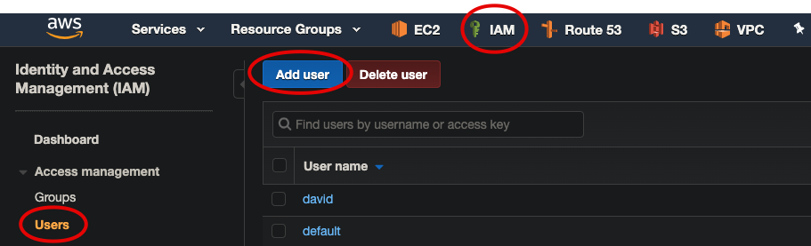
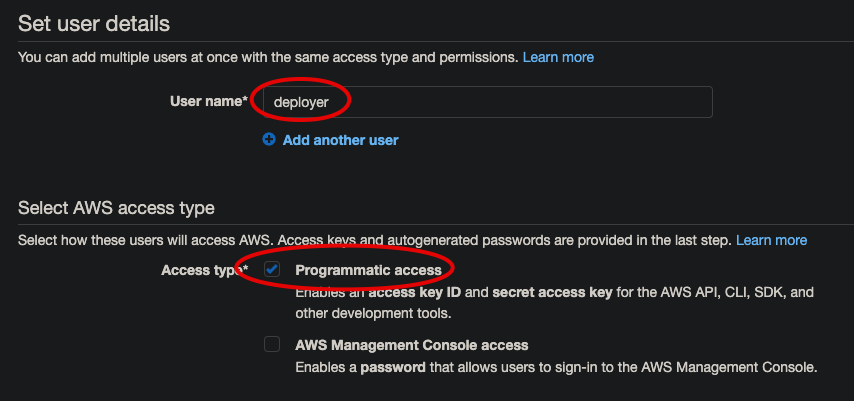
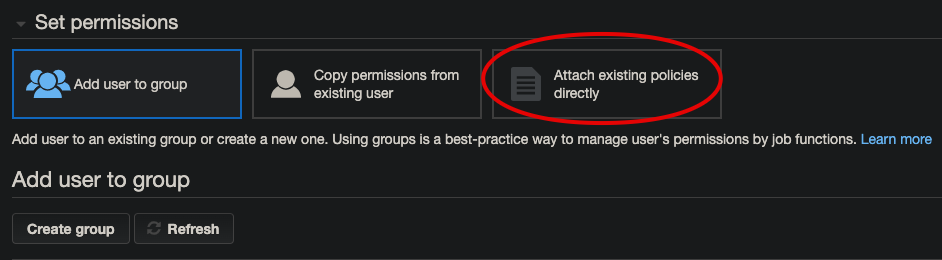
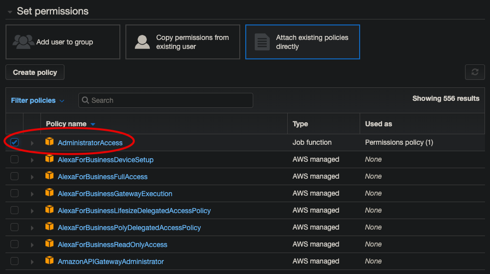

# AWS Credentials



---



Initially we shall set up this user without a group and jump straight to policies:



---



```bash
aws/key-pairs/deployer at ☸️ docker-desktop
➜ aws configure
AWS Access Key ID [****************QANV]:
AWS Secret Access Key [****************BSPL]:
Default region name [eu-west-2]:
Default output format [json]:
```

